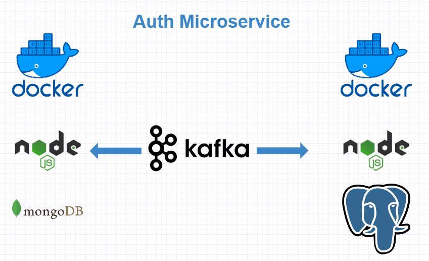

<div align="center">
<h1>Nodejs Docker Kafka Microservice</h1>
   <div align="center">
    
  </div>
   <h2>Microservice Boilerplate Project</h2>
</div>

## Installation steps

1. Clone the Repo and install the requirements

```
git clone https://github.com/BahadirYurdakul/microservice-boilerplate.git
cd app_mongodb && npm install && cd.. && cd app_postgres && npm install
```

2. Install Docker from [here](https://docs.docker.com/engine/install/)
3. Start Docker Compose
```
docker-compose up
```
